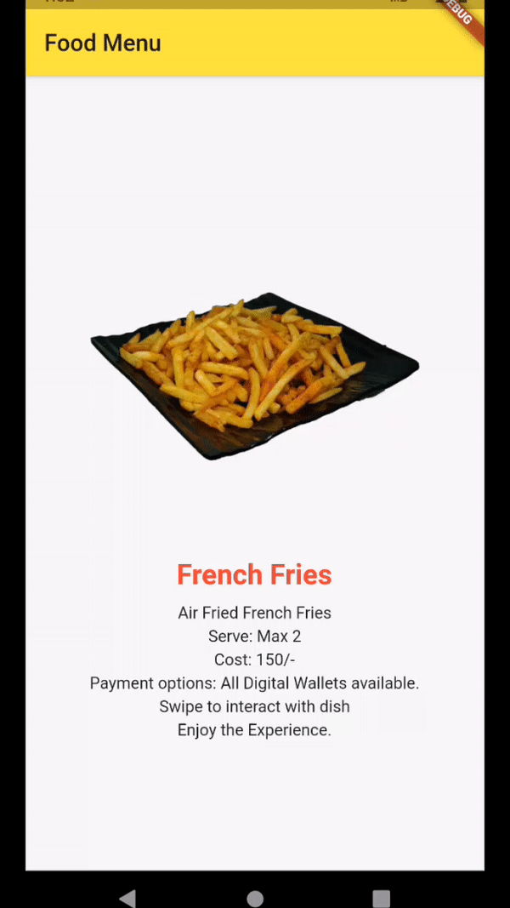

# Restaurant_menu

A Restaurant Menu card in a 3d vision. Giving out more detail to the food item that the customer order.

# Features in the project

We can interact in the app with our finger. Rotate the object and you can find the object in another angle. 
<br></br>



### Package details:
imageview360 1.0.0

## Installation
[](https://pub.dev/packages/imageview360)

Add the Package
```yaml
dependencies:
  imageview360: ^1.0.0
```
## How to use

Import the package in your dart file

```dart
import 'package:imageview360/imageview360.dart';

```

##### Basic usage :

```dart
ImageView360(
     key: UniqueKey(),
     imageList: imageList,
),
```

Note: For ImageView360 to show instant changes on hot reload, you need to provide `UniqueKey()` so that the widget rebuilds every time.

##### Customisable usage :
```dart
ImageView360(
    key: UniqueKey(),                                           
    imageList: imageList,                                       
    autoRotate: true,                                           //Optional
    rotationCount: 2,                                           //Optional
    rotationDirection: RotationDirection.anticlockwise,         //Optional
    frameChangeDuration: Duration(milliseconds: 50),            //Optional
    swipeSensitivity: 2,                                        //Optional
    allowSwipeToRotate: true,                                   //Optional
)
```
Note: For better experience always precache image before providing the images to the widget as follows.

##### Example for loading and precaching images from assets :

```dart
 List<AssetImage> imageList = List<AssetImage>();
   for (int i = 1; i <= 52; i++) {
      imageList.add(AssetImage('assets/sample/$i.png'));
// To precache images so that when required they are loaded faster.
      await precacheImage(AssetImage('assets/sample/$i.png'), context);
    }
```


## For more Information regarding Flutter

This project is a starting point for a Flutter application.

A few resources to get you started if this is your first Flutter project:

- [Lab: Write your first Flutter app](https://flutter.dev/docs/get-started/codelab)
- [Cookbook: Useful Flutter samples](https://flutter.dev/docs/cookbook)

For help getting started with Flutter, view our
[online documentation](https://flutter.dev/docs), which offers tutorials,
samples, guidance on mobile development, and a full API reference.
